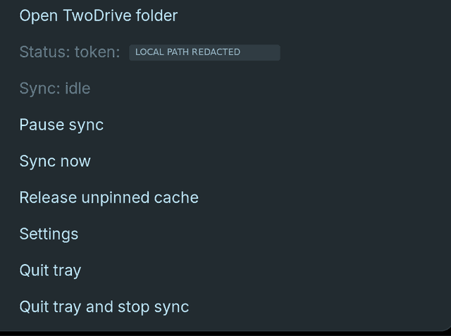
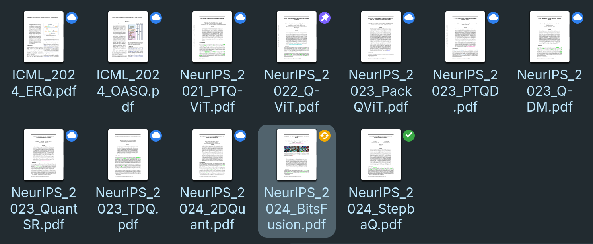
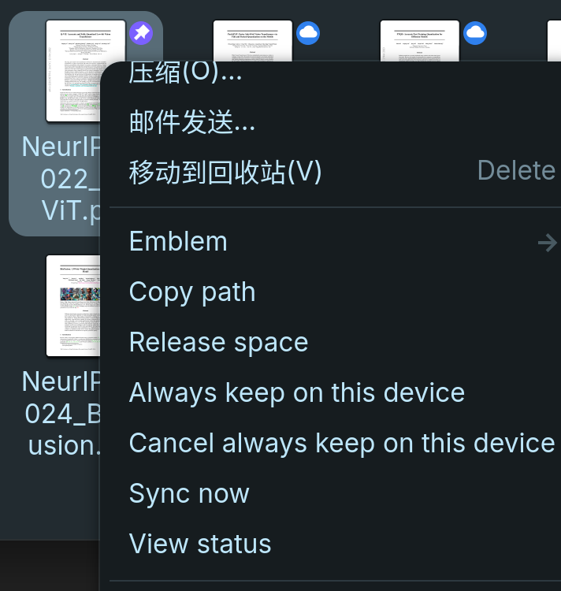

  

<h1 align="center">TwoDrive</h1>

<strong>在 GNOME 文件管理器中，按需使用 OneDrive。</strong>

  <a href="README.md">English</a> · 简体中文

  <a href="doc/getting-started.zh-CN.md"><strong>开始使用</strong></a> ·
  <a href="https://github.com/LumiaBlack51/twodrive/releases/latest">下载</a> ·
  <a href="doc/README.md">文档</a> ·
  <a href="CONTRIBUTING.md">参与贡献</a>

TwoDrive 是一个面向 **GNOME/Linux、使用 Rust 编写的实验性 OneDrive 客户端**。无需先下载整个云盘，就能在 Nautilus 中浏览云端文件；需要时下载，重要文件固定保留，不再需要的缓存随时申请释放。它通过可读写的 FUSE 挂载，将日常应用、本地缓存和后台 Microsoft Graph 同步连接起来，提供类似 OneDrive Files On-Demand 的使用体验。

  
   
  真实应用的空闲托盘菜单；本地路径已打码。

## 在熟悉的文件管理器里工作

| 桌面上的体验 | 背后的机制 |
| --- | --- |
| **先浏览，按需下载。** 云端占位视图展示名称、大小和目录结构，读取文件时才获取内容。 | **本地先保存，后台再同步。** 在挂载目录内新建、编辑、重命名、移动或删除；待同步修改会记录在本地，以便重试。 |
| **决定哪些文件留在本机。** 右键选择 **Always keep on this device（始终保留）** 或 **Release space（释放空间）**。 | **看得见的同步状态。** Nautilus 图标标记文件状态，托盘显示正在上传或下载的文件及字节进度。 |
| **沿用桌面入口。** 从托盘打开同步目录，在只读 Settings 窗口查看路径和缓存占用。 | **恢复中断的工作。** 持久化任务队列和大文件续传，将“本地保存成功”与“云端同步完成”明确区分。 |

默认挂载位置是 `~/TwoDrive/OneDrive`。[日常使用与桌面操作 →](doc/usage.zh-CN.md)

## 文件管理器集成

在 Nautilus 中直接查看文件状态，通过右键菜单管理云端文件。

### 一眼看懂文件状态

  
   
  仅云端、始终保留、处理中与本地可用，在同一文件夹中清晰呈现。

<strong>展开查看各状态标记的含义</strong>

| 状态 | 含义 |
| --- | --- |
|  **仅云端** | 挂载目录中可见，但本地没有缓存内容；读取时需要下载。 |
|  **处理中** | 正在下载、写入、等待上传或上传中；不一定代表此刻正在传输。 |
|  **本地可用** | 内容已缓存，满足条件时可以释放；不等同于“始终保留”。 |
|  **始终保留** | 自动缓存清理保护固定内容；主动“释放空间”会取消固定。离线使用前仍需确认下载已完成。 |
|  **需要处理** | 存在错误或冲突，需要检查，不能视为已完成云端同步。 |

 +  **等待释放：** 在写入或上传尚未完成时申请了释放空间。必须等上传成功且文件句柄关闭，才会移除本地数据。

文件夹标记汇总子项状态，并不意味着所有文件都已缓存。即使父目录已经固定，新发现的云端文件仍默认保持仅云端。[固定与释放的具体语义 →](doc/usage.zh-CN.md#固定与释放内容)

### 右键即可管理

将选定内容保留在本机，释放缓存而不删除云端文件，或查看当前状态，无需离开文件管理器。

  
   
  本地保留、同步与状态查看，直接从原生右键菜单操作。

[查看完整桌面操作说明 →](doc/usage.zh-CN.md#固定与释放内容)

## 开始使用

**安装 → 注册 Microsoft 应用 → 登录并挂载。**

从 [Releases](https://github.com/LumiaBlack51/twodrive/releases/latest) 下载 **amd64 `.deb` 安装包及校验文件**。软件包面向 Ubuntu/Zorin OS 的 GNOME 环境，包含后台服务、CLI、Nautilus 扩展、托盘和 Settings 辅助程序。

按照[安装与登录指南](doc/getting-started.zh-CN.md)完成 Microsoft Entra/Azure 应用注册、Graph 权限配置和服务启动。登录使用 OAuth 2.0 + PKCE：**需要自己的 client ID，不需要 client secret**。其他 Linux 环境可参考[源码构建指南（英文）](CONTRIBUTING.md#build-and-check)。

## 使用重要文件之前

> [!WARNING]
> TwoDrive 仍是实验性软件，请为重要文件保留独立备份。**在挂载目录内删除文件，也会删除云端项目；“释放空间”不会。** 本地保存成功不代表云端上传已经完成。

令牌以本地 JSON 文件保存，权限为 `0600`，并非加密钥匙环；尚未接入 Secret Service。完整的 POSIX 所有权、权限和目录时间戳语义也不会被保留。

桌面辅助程序仍有明确限制：**Settings 目前只读；Pause sync 目前只改变托盘显示，不会暂停后台服务。** 使用前请阅读[当前限制与安全边界](doc/usage.zh-CN.md#当前限制与安全边界)。

## 参与开发

欢迎提交可复现的问题、代码和文档改进。[贡献指南（英文）](CONTRIBUTING.md)介绍了 Rust 工作区、测试命令，以及不会触碰真实 OneDrive 的隔离 mock 环境。[版本历史](CHANGELOG.zh-CN.md)和[工程记录](doc/README.md#engineering-notes)单独维护，不再占据项目首页。

采用 [MIT 许可证](LICENSE)。这是独立项目，并非 Microsoft 官方客户端。
